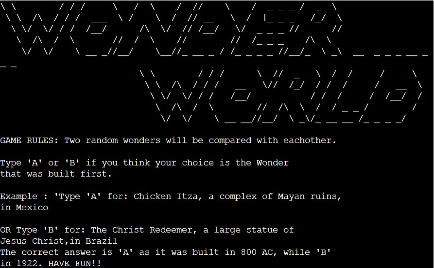
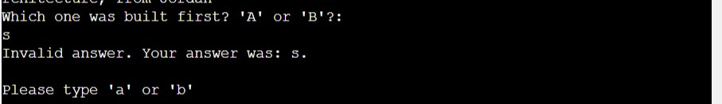
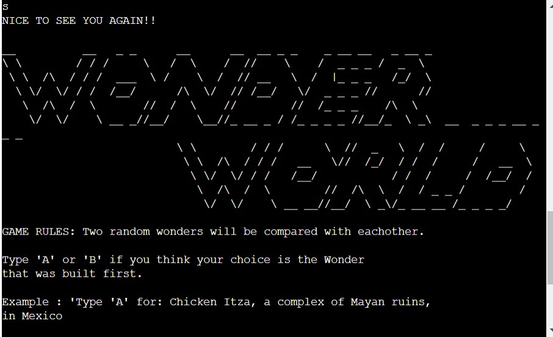
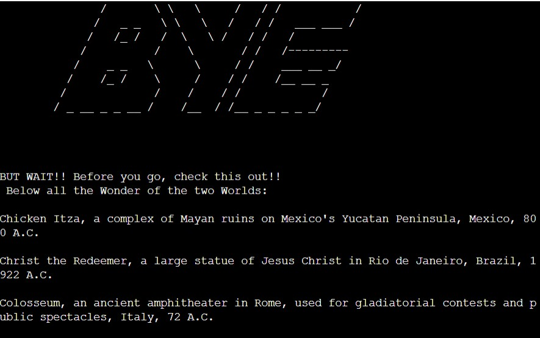
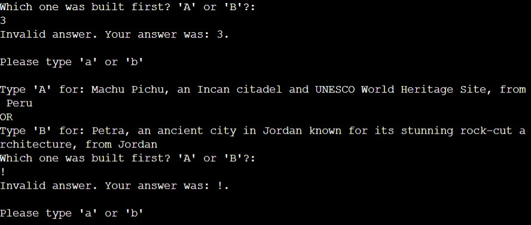

# WONDERWORLD game
Wonderworld game is a Python terminal game, which runs in the Code Institute moke terminal on Heroku.

It's a general knowledge quiz about the 14 Wonders of the World, 7 from the Ancient World and 7 from the Classical World. The purpose of the game is to test the user knowledge with a series of questions. 

WonderWorld is a game that aims to entertain the user while, through the gameplay, intriguing and, where possible, teaching something new.

[Here is a live view of the project.](https://wonderworld.herokuapp.com/)

## Game instructions

The terminal will generate random questions about the Wonders of the World, comparing two wonders against each other in each round.

The user will have to choose which one of the two Wonders is the oldest by pressing the key 'a' or 'b'. If the user answers correctly, can then proceed to the next round and his/her score will increase. If they answer incorrectly, the game will end.

## Features

- Random questions generation
   - Every question is randomly generated and will change at every round.
   - In the questions, only the name of the Wonder, its location and description will be displayed while the the date ofits built will remain hidden.

   

- Keep track of the score.

- Accepts user input
  - If the user inserts an invalid input, anything rather than 'a' or 'b', the computer will let him/her notice and will ask for a valid input to keep playing.

 

- Start a new game
  - When the user will give an incorrect answer the game will stop. However the user will be able to re-start the game if wanted, by pressing 'Y' or 'N'.

  
  )
   - If the user will choose 'Y' the game will start again.

   

   - Else the game will end, the terminal will say 'bye' to the user and the fully description of all the 14 Wonders will be displayed for the user.

   

## Testing
I personally executed a manual testing on the following:
 - Passed the code through a PEP8 Linter and confirm there are no problems. 2 minor problems where encountered:
 - 154: E501 line too long (80 > 79 characters)
 - 156: W292 no newline at end of file
 

- Testing for invalid inputs: giving numbers, symbols or letters, same input twice.

-Tested in my local terminal.

## Bugs
### Solved Bugs

- When giving an invalid input i was not receiving the expected outcome due to indentation problem of the if-else statement.

### Remaining Bugs
 -No unsolved bugs left.

## Deployment

- This Project was deployed using Code Institute's moke terminal for Heroku.

- Commit and push final changes on Github.
- Create a new app on Heroku.
- Set the buildbacks to Python and Nodej in this order.
- Add Config Var with key= "PORT" and value = "8000".
- Link the Heroku app to the repositary.
- Set a manual Deploy.
- Click on deploy.

## Credits
- Code Institute for the deployment terminal.
- Wikipedia and National Geographic for The Wonders of the World informations.

